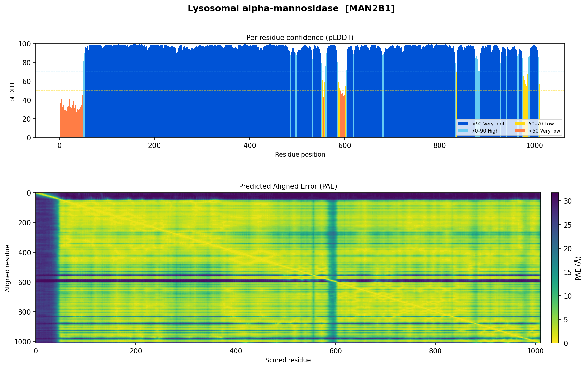

# AlphaFold "Surprise Me" — Educational Guide

A pipeline that fetches a random protein, visualizes its predicted structure confidence, and links it to published research — all from public databases, with no lab equipment and no GPU.

This guide explains the biology, the data, and how to read the output graphs.

---

## Part 1 — What Is a Protein?

Proteins are the molecular machines of life. Every cell in your body contains thousands of different proteins, each built from the same set of 20 building blocks called **amino acids**. The order of those amino acids — encoded in your DNA — determines everything: how the protein folds, what it does, and what happens when it breaks.

The sequence of amino acids is called the **primary structure**. But a string of amino acids by itself does not do anything. To function, the chain must fold into a precise three-dimensional shape. This shape is what allows a protein to:

- catalyse a chemical reaction (enzymes)
- carry oxygen through the blood (haemoglobin)
- receive signals from the outside of a cell (receptors)
- build or destroy other molecules (proteases, kinases, etc.)

The relationship between sequence and shape is one of the deepest problems in biology — it took decades of experimental work and, ultimately, AI to crack.

---

## Part 2 — Monomers, Homodimers, and Heterodimers

Many proteins do not work alone. They come together in groups called **complexes**, and the geometry of how they assemble is often as important as the shape of the individual subunit.

| Term | Meaning | Example |
|------|---------|---------|
| **Monomer** | A single protein chain working independently | Lysozyme |
| **Homodimer** | Two *identical* chains bound together | PCNA (DNA clamp), p53 tumour suppressor |
| **Heterodimer** | Two *different* chains bound together | Insulin receptor α/β subunits |
| **Oligomer** | Any multi-subunit assembly (trimer, tetramer, …) | Haemoglobin (α₂β₂ tetramer) |

**Why do proteins dimerize?**

- **Cooperativity** — binding of one chain changes the shape of the partner, enabling on/off switching (e.g. haemoglobin's oxygen affinity)
- **Active site formation** — each chain contributes half of the catalytic pocket; neither works alone (this is exactly what the slime mold example in the AlphaFold announcement illustrated)
- **Stability** — burying hydrophobic surfaces at the interface lowers energy and protects the protein from degradation
- **Allostery** — regulatory signals transmitted across the interface allow remote control of activity

Homodimers are the most common complex type because the same gene produces both subunits — evolution only needs to optimise one sequence to build a symmetric machine.

---

## Part 3 — What AlphaFold Predicts (and What It Does Not)

### The problem AlphaFold solved

Determining a protein's 3D shape experimentally requires X-ray crystallography, cryo-electron microscopy, or NMR — techniques that take months and can cost tens of thousands of dollars per structure. As of 2021, fewer than 200,000 experimental structures existed for hundreds of millions of known proteins.

AlphaFold is a deep learning system trained on every known protein structure. Given only the amino acid sequence, it predicts the 3D coordinates of every atom. It does not run a physical simulation — it pattern-matches against everything evolution has already solved.

### What the AlphaFold Database contains

| Entry type | ID format | Count (2026) | Notes |
|---|---|---|---:|
| Monomers | `AF-P00520-F1` | ~241 million | All reviewed UniProt entries + many more |
| Homodimer complexes | `AF-0000000066503175` | ~1.7 million (high conf.) + ~18 million (bulk) | Added March 2026 |
| Heterodimer complexes | — | In progress | Expected later in 2026 |

**What AlphaFold predictions include:**
- Atomic coordinates (`.cif` / `.pdb` file)
- Per-residue pLDDT confidence score
- Predicted Aligned Error (PAE) matrix
- For complexes: ipTM (interface confidence) and pTM (overall quality)

**What AlphaFold predictions do NOT include:**
- Ligands, cofactors, metals, or drug molecules
- Post-translational modifications (phosphorylation, glycosylation, etc.)
- Conformational dynamics — you get one static snapshot
- Information about what the protein binds to or when it is expressed

---

## Part 4 — Reading the Output Graphs

The pipeline produces a two-panel figure for every protein it fetches. Here is how to read each panel.

---

### Panel 1 — pLDDT Bar Chart (top)



**What is pLDDT?**

pLDDT stands for **predicted Local Distance Difference Test**. It is AlphaFold's own estimate of how confident it is in the predicted position of each residue, expressed as a score from 0 to 100.

It is calculated by asking: *"If I superimpose this predicted structure onto a hypothetical true structure, how well would the local neighbourhood of this residue agree?"* A score of 90 means AlphaFold is very sure. A score of 30 means it is essentially guessing.

**X-axis — Residue position**

Each bar represents one amino acid in the protein chain, numbered from 1 (the N-terminus, the start of the chain) to N (the C-terminus, the end). For a protein with 1,011 residues like MAN2B1, the chart spans position 1–1,011.

For homodimer complex predictions, both chains are concatenated — chain A fills the left half and chain B fills the right half, separated by a vertical dashed line.

**Y-axis — pLDDT score (0–100)**

| Colour | Score range | Meaning |
|--------|-------------|---------|
| Dark blue | >90 | **Very high confidence** — backbone and side chains reliable, suitable for drug docking or detailed structural analysis |
| Light blue | 70–90 | **High confidence** — backbone geometry reliable, side chain positions less certain |
| Yellow | 50–70 | **Low confidence** — likely a flexible or partially disordered region; interpret cautiously |
| Orange | <50 | **Very low confidence** — AlphaFold cannot fold this region; strongly suggests the sequence is intrinsically disordered in isolation |

**What trends to look for:**

- **Tall dark blue bars across most of the protein** → well-folded, globular domain; high experimental agreement is expected
- **Dips to orange/yellow at the N- or C-terminus** → signal peptides, propeptides, or unstructured tails are common at chain ends and are often cleaved off after translation; they are not expected to be ordered
- **Internal dips** → linker regions between two structured domains, active-site loops, or regions that become ordered only when bound to a partner (these are especially interesting — they may fold upon binding a ligand or another protein)
- **Entire protein is orange** → intrinsically disordered protein (IDP); these have function but no fixed 3D shape; AlphaFold cannot and should not be expected to predict a single structure

---

### Panel 2 — PAE Heatmap (bottom)

**What is PAE?**

PAE stands for **Predicted Aligned Error**. While pLDDT tells you about local confidence (how well each residue is positioned *within its own neighbourhood*), PAE tells you about **global confidence** — how certain AlphaFold is about the *relative position* of any two residues in the structure.

Formally: the PAE value at position (row i, column j) answers the question: *"If I superimpose the predicted and true structures by aligning at residue j, how far off (in Å) would residue i be?"*

Low PAE = the two residues are confidently positioned relative to each other.
High PAE = their relative arrangement is uncertain (they may be in different domains that are connected by a flexible linker).

**X-axis — Scored residue**

The residue whose position is being *evaluated*. Runs across the full sequence (1 → N).

**Y-axis — Aligned residue**

The residue that acts as the *reference frame* for the alignment. Also runs 1 → N.

The matrix is not perfectly symmetric — the value at (i, j) can differ slightly from (j, i) because AlphaFold evaluates confidence from each residue's local perspective.

**Colour scale — PAE in Ångströms (Å)**

| Colour | PAE value | Meaning |
|--------|-----------|---------|
| Dark purple/black | 0–5 Å | **Confident** relative positioning |
| Teal/green | 5–15 Å | Moderate confidence |
| Yellow/bright | >15–30 Å | **Uncertain** — domains may be mobile relative to each other |

**Key patterns to identify:**

| Pattern | What it means |
|---|---|
| Dark diagonal band | Expected — every residue is confident relative to itself |
| Dark off-diagonal **square blocks** | Structured domain — all residues within the block are well-positioned relative to each other |
| Bright stripe across a row or column | A disordered linker or terminal tail — that residue has uncertain position relative to everything else |
| Two dark blocks separated by a bright cross | Two independent domains connected by a flexible linker — they fold correctly on their own but orient freely relative to each other |
| Uniformly dark entire matrix | Compact, single-domain protein — very high global confidence |

**For homodimer complexes specifically:**

The PAE matrix for a complex covers both chains. You can divide it into four quadrants:
- **Top-left:** intra-chain A confidence
- **Bottom-right:** intra-chain B confidence
- **Top-right / bottom-left:** *inter-chain* confidence — how well AlphaFold knows the relative orientation of the two subunits

A dark inter-chain quadrant is the best evidence that the predicted dimer interface is reliable. A bright (high PAE) inter-chain quadrant means the two subunits may tumble freely relative to each other and the dimer interface should not be trusted for downstream analysis.

---

## Part 5 — Worked Example: MAN2B1 (Lysosomal Alpha-Mannosidase)

This run randomly selected **Lysosomal alpha-mannosidase**, encoded by the **MAN2B1** gene in humans (UniProt: O00754). Here is how to interpret everything the pipeline returned.

### The protein

Lysosomal alpha-mannosidase is an enzyme that lives inside lysosomes — the cell's recycling compartments. Its job is to cleave mannose sugars off glycoproteins (proteins decorated with sugar chains) during their degradation. Without this enzyme, partially degraded glycoproteins accumulate inside the lysosome, causing a lysosomal storage disorder.

It is a large enzyme: **1,011 amino acids**, and it functions as a **homodimer** — two identical subunits come together to form the active enzyme. The mature enzyme is also heavily processed: a signal peptide at the N-terminus directs it into the secretory pathway, and the chain is proteolytically cleaved into several subunits that reassemble into the active form.

### Reading the pLDDT chart

- **Residues 1–50 (left edge, orange/yellow):** The N-terminal signal peptide. This short sequence is recognised by the ribosome and fed into the endoplasmic reticulum — it is then cleaved off and never present in the mature enzyme. AlphaFold correctly identifies it as unstructured in isolation.
- **Residues 50–560 (dark blue):** The first large structured domain. Nearly all bars exceed 90 — AlphaFold is highly confident across this entire stretch.
- **Residues ~575–600 (sharp orange dip):** A short flexible loop or linker between two subdomains. This region likely becomes ordered when the protein assembles or when a substrate binds. It is a biologically interesting region to investigate.
- **Residues 600–1,011 (dark blue):** The second large structured domain, equally well-predicted.
- **Overall: mean pLDDT = 91.3, with 85% of residues above 90** — this is an exceptionally well-folded protein by AlphaFold's standards, consistent with it being a stable, well-characterised enzyme.

### Reading the PAE heatmap

- **Dark green/teal across almost the entire matrix:** Global confidence is high — AlphaFold knows how every part of this protein is positioned relative to every other part.
- **Slightly lighter region around position 575–600 (visible as a faint stripe):** Matches exactly the orange dip in the pLDDT chart. This loop is uncertain not just locally but in relation to the rest of the protein.
- **No bright cross-shaped pattern:** This means the two large domains do not tumble freely — they are tightly packed together, consistent with a compact, globular enzyme architecture.
- **Note — this is a monomer entry.** Although MAN2B1 is annotated as a homodimer in UniProt, the AlphaFold Database had only a monomer prediction available for this accession at time of retrieval. The PAE matrix therefore does not contain inter-chain information. A complex prediction (with the 4-quadrant PAE structure) would appear when AlphaFold adds a homodimer entry for this protein.

### What the literature says

The pipeline found five PubMed papers, all converging on the same disease:

**α-Mannosidosis** is a rare autosomal recessive disorder caused by loss-of-function mutations in MAN2B1. Without the enzyme, mannose-rich oligosaccharides accumulate in lysosomes across the body, leading to progressive intellectual disability, skeletal abnormalities, immune deficiency, and hearing loss.

| Paper | Key finding |
|-------|-------------|
| Kuokkanen et al. 2011 (*Hum Mol Genet*) | Characterised 35 MAN2B1 variants — most missense mutations cause misfolding and ER retention rather than loss of catalytic activity |
| Hashmi et al. 2024 (*Front Genet*) | Identified a novel frameshift variant in a consanguineous family using exome sequencing |
| De Marchis et al. 2013 (*Plant Physiol*) | Used transgenic tobacco to study MAN2B1 trafficking — revealed an ER-to-vacuole route bypassing the Golgi |
| Wu et al. 2014 (*J Pediatr Endocrinol Metab*) | Diagnosed α-mannosidosis in a Chinese child; confirmed by sequencing |
| Sbaragli et al. 2005 (*Hum Mutat*) | Identified five novel MAN2B1 mutations in Italian families, mapped them to conserved residues |

**Connecting structure to disease:** The Kuokkanen finding is especially relevant here. Most disease mutations cause misfolding — meaning the protein cannot reach its mature 3D shape and is degraded before it ever reaches the lysosome. The high pLDDT scores across the bulk of MAN2B1 in the wild-type prediction reflect just how stable and well-folded the normal enzyme is. A single amino acid change in one of those high-confidence regions can be enough to collapse the fold and cause disease.

---

## Part 6 — Things to Try Next

| Experiment | What you will learn |
|---|---|
| Re-run the pipeline several times | See how pLDDT patterns differ across protein families — compare a large stable enzyme like MAN2B1 to a small signalling protein |
| Note which runs return `Is complex: True` | Those entries will show the 4-quadrant PAE — examine the inter-chain blocks |
| Look up the orange dip residues in UniProt | Check the "PTM/Processing" section — signal peptides and propeptides are annotated there and often explain N-terminal disorder |
| Save the `.cif` file and open in ChimeraX or Mol* | Colour by pLDDT to see the confidence painted directly onto the 3D structure (dark blue = confident) |
| Cross-reference a high-confidence residue with a disease mutation from the literature | The structure lets you ask: is the mutated residue buried in the core, or on the surface? Core mutations usually disrupt folding; surface mutations often disrupt binding |

---

## Quick Reference

```
pLDDT  >90  dark blue   very high confidence — trust the coordinates
       70-90 light blue  high confidence — backbone good
       50-70 yellow      low — flexible region
       <50   orange      very low — likely disordered

PAE    dark (0-5 Å)     residues confidently positioned relative to each other
       teal (5-15 Å)    moderate confidence
       yellow (>15 Å)   uncertain relative arrangement

ipTM   >0.8             reliable complex interface (complex entries only)
       0.6-0.8          grey zone
       <0.6             interface likely unreliable
```
